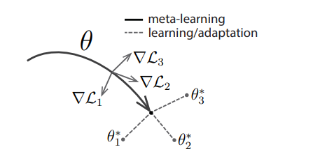

# Model Agnostic Meta Learning (MAML)
This is an implementation of the paper ["Model Agnostic Meta Learning"](https://arxiv.org/abs/1703.03400) (MAML) paper.
I also plan to implement ["How to train your MAML"](https://arxiv.org/abs/1810.09502) (MAML++).

## Introduction

MAML - Model Agnostic Meta Learning approaches the Few Shot Learning (FSL) problem by using the "prior knowledge about learning approach". 
1. There is a meta learner and task specific learners. The task specific learner at each forward pass clone the parameters of the meta learner. 
2. Then each of the task specific learners update their paramaters by undergoing some steps of gradient descent (usually 4-5); learning from using examples from the ```support set```. This is called ```acquiring fast knowledge```.  
3. Then each of the task specific learner give predictions for the ```query set``` of the specific task and hence a loss for each task is calculated by using predictions from the task specific models ```(θ*)```. 
4. This loss is then used to update the parameter of the meta learner ```(θ)``` which hence learners task agnostic knowledge and is called ```slow task agnostic learning```



Figure 1: MAML which optimizes for a representation θ that can quickly adapt to new tasks. Taken from ["Model Agnostic Meta Learning"](https://arxiv.org/abs/1703.03400)


You must agree to terms and conditions in the [LICENSE](./LICENSE) file to use this code. If you choose to use the Mini-Imagenet dataset, you must abide by the terms and conditions in the [ImageNet LICENSE](./ImageNetLicense.md)

## Installation

I recommend 
using the conda package management library. More specifically, 
[miniconda3](https://repo.continuum.io/miniconda/Miniconda3-latest-Linux-x86_64.sh), as it is lightweight and fast to install.
If you have an existing miniconda3 installation please start at step 3:
 1. ```wget https://repo.continuum.io/miniconda/Miniconda3-latest-Linux-x86_64.sh```
 2. Go through the installation.
 3. Activate conda
 4. ```conda create -n maml_pyt python=3.7```
 5. ```conda activate maml_pyt```
 6. Install Pytorch by visiting [here](https://pytorch.org/get-started/locally/).
 7. Run ```bash install.sh```


## Datasets

Download Mini ImageNet from [gdrive folder](https://drive.google.com/file/d/1qQCoGoEJKUCQkk8roncWH7rhPN7aMfBr/view?usp=sharing). Used from [Antreas Antoniou GitHub](https://github.com/AntreasAntoniou/HowToTrainYourMAMLPytorch)


Note: By downloading and using the mini-imagenet datasets, you accept terms and conditions found in [imagenet_license.md](./ImageNetLicense.md) 

### Mini ImageNet Structure:

```
Dataset
    ||
 ___||_________
|       |     |
Train   Val  Test
|_________________________
    |       |            |
 class_0 class_1 ... class_N
    |       |___________________
    |                           |
samples for class_0    samples for class_1
```
Note: Refer to the directory of dataset under [conf.py](./configs/conf.py)

# Code Structure
1. configs : Manage all the training and dataset config from [conf.py](./configs/conf.py) .
2. dataset : [Mini ImageNet Dataset](./dataset/datasets.py) where the dataset is represented as episodes is done here, along with the dataloader implementation. [Class Map](./dataset/classmap.csv) represent the mapping of the mini-imagenet classes into human readable form.
3. engine: This includes the maml [trainer](./engine/trainer.py) resposible for training maml along with implementation of an [optimizer](./engine/optimizers.py) which explicitly takes gradients from torch.autograd and returns a param dictionary. This is required for n-th order derivates.
4. utils: Contains training, visualisation and other generic utilities.
5. [train.py](./train.py): Entry point for training. [MAML.ipynb](./MAML.ipynb) is an interactive notebook for the same.
6. images: includes backpropagation graph images and learning curve images.

# Running the Experiment
1. Download the dataset from the link in above Dataset section.
2. Extract the dataset and place it in a folder named "Dataset". Edit the path of this folder in [conf.py](./configs/conf.py) under self.dataset.root_path.
3. Setup conda environment by following instruction under installation section.
4. Use ```python train.py``` to execute the training script. To have a more interactive learning use [MAML.ipynb](./MAML.ipynb)
 
# Results

The initial version of MAML suffers from gradient explosion when the internal loop optimizer is a complex optimizer like Adam involving exponential gradients. On using a simple gradient descent for inner loop training, the gradient explosion is solved. However the loss curves clearly show overfitting. 


Figure 2: Loss curves which clearly point to overfitting.

# Future Work

1. Solve over-fitting in the training of MAML.
2. Include Adam like optimizer in the inner training loop of MAML.
3. Include first order approximation and other improvements from MAML++.
 