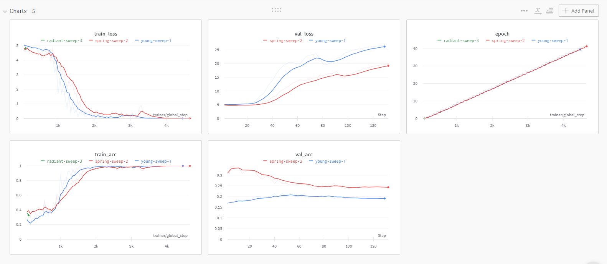
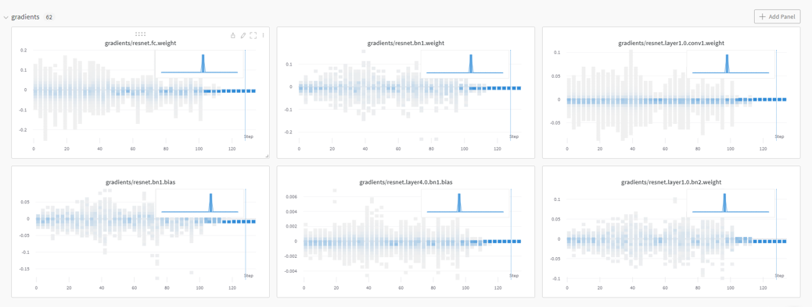

# Model Agnostic Meta Learning (MAML)
This is an implementation of the paper ["Model Agnostic Meta Learning"](https://arxiv.org/abs/1703.03400) (MAML) paper.
I also plan to implement ["How to train your MAML"](https://arxiv.org/abs/1810.09502) (MAML++).

## Introduction

MAML - Model Agnostic Meta Learning approaches the Few Shot Learning (FSL) problem by using the "prior knowledge about learning approach". 
1. There is a meta learner and task specific learners. The task specific learner at each forward pass clone the parameters of the meta learner. 
2. Then each of the task specific learners update their paramaters by undergoing some steps of gradient descent (usually 4-5); learning from using examples from the ```support set```. This is called ```acquiring fast knowledge```.  
3. Then each of the task specific learner give predictions for the ```query set``` of the specific task and hence a loss for each task is calculated by using predictions from the task specific models ```(θ*)```. 
4. This loss is then used to update the parameter of the meta learner ```(θ)``` which hence learners task agnostic knowledge and is called ```slow task agnostic learning```


Figure 1: MAML which optimizes for a representation θ that can quickly adapt to new tasks. Taken from ["Model Agnostic Meta Learning"](https://arxiv.org/abs/1703.03400)


You must agree to terms and conditions in the [LICENSE](./LICENSE) file to use this code. If you choose to use the Mini-Imagenet dataset, you must abide by the terms and conditions in the [ImageNet LICENSE](./ImageNetLicense.md)

## Installation

I recommend 
using the conda package management library. More specifically, 
[miniconda3](https://repo.continuum.io/miniconda/Miniconda3-latest-Linux-x86_64.sh), as it is lightweight and fast to install.
If you have an existing miniconda3 installation please start at step 2:
 1. ```wget https://repo.continuum.io/miniconda/Miniconda3-latest-Linux-x86_64.sh```
 2. Go through the installation and activate conda
 3. ```make conda-update```
 4. ```conda activate maml_pytorch_lightning```
 5. ```make pip-tools```
 6. add ```export PYTHONPATH=.:$PYTHONPATH``` to your ```~/.bashrc``` and ```source ~/.bashrc```


## Datasets

Using Mini ImageNet from [Antreas Antoniou GitHub](https://github.com/AntreasAntoniou/HowToTrainYourMAMLPytorch). The download and setup are done via code.


Note: By downloading and using the mini-imagenet datasets, you accept terms and conditions found in [imagenet_license.md](./ImageNetLicense.md) 

### Mini ImageNet Structure:

```
Dataset
    ||
 ___||_________
|       |     |
Train   Val  Test
|_________________________
    |       |            |
 class_0 class_1 ... class_N
    |       |___________________
    |                           |
samples for class_0    samples for class_1
```

# Code Structure

Code Structure is inspired from [fsdl course](https://github.com/sahamrit/fsdl-text-recognizer-2021-labs/tree/174ebbdc065442175d9457b7a97d6e065f3d9cd0).

1. ```few_shot_image_classification```: This folder consists of ```model```, ```data``` and ```trainer``` using pytorch lightning.

    a. ```models``` : Any new model architecture should be defined here.

    b. ```data``` : Data downloading, processing, loading, batching etc. code related to any new dataset must be here. We use ```pl.LightningDataModule``` for organised code.

    c. ```lit_models``` : Training related code using pytorch lightning is written here. This involves defining training_step, optimizers etc. We use ```pl.LightningModule``` for harnessing all benefits of Lightning.

2. ```training``` : Code related to configuring and running experiments sit here.

3. ```tasks``` : Tasks like Linting and tests are setup for running during CI build.

4. ```requirements``` : All dev and prod dependencies are specified in ```.in``` files and used by ```pip-tools```.

5. Additonal files related to ```wandb``` sweeps , ```CircleCI``` setup and ```Linting``` is also present.

# Running the Experiment

1. Setup the environment following the above instructions

2. Run ```    python training/run_experiment.py --gpus=-1 --wandb --data_class=MiniImagenet --model_class=ResNetClassifier --num_workers=6 --accelerator=ddp --val_check_interval=5 --batch_size=3 --inner_loop_steps=1 --support_samples=5 --track_grad_norm=2```

3. Change ```data_class``` and ```model_class``` for new data sources and models respectively.

4. Training was run on ```Standard_NC12_Promo```. Keep in mind the following params if you encounter ```CUDA OOM ERROR```.

    a. ```inner_loop_steps``` : Since we backprop through all the stages the inner model updates during training, the memory increases ~linearly with this.

    b. ```batch_size , support_samples and query_samples``` : The number of images in a batch are ```batch_size * episode_classes * (support_samples + query_samples)``` which can be typically large. So hence consider batch_size as number of tasks you want to train MAML across.
 
# Results

The initial version of MAML suffers from gradient explosion when the internal loop optimizer is a complex optimizer like Adam involving exponential gradients. On using a simple gradient descent for inner loop training, the gradient explosion is solved. However the loss curves clearly show overfitting. 



Figure 2: Loss curves which clearly point to overfitting.



Figure 3: As clearly visible from gradient histogram over time. The gradients have become zero and model has overfitted on training set.

# Future Work

1. Solve over-fitting in the training of MAML and check for bugs in data preparation, batch_norm, train/eval flag etc.
2. Include Adam like optimizer in the inner training loop of MAML.
3. Include first order approximation and other improvements from MAML++.
 